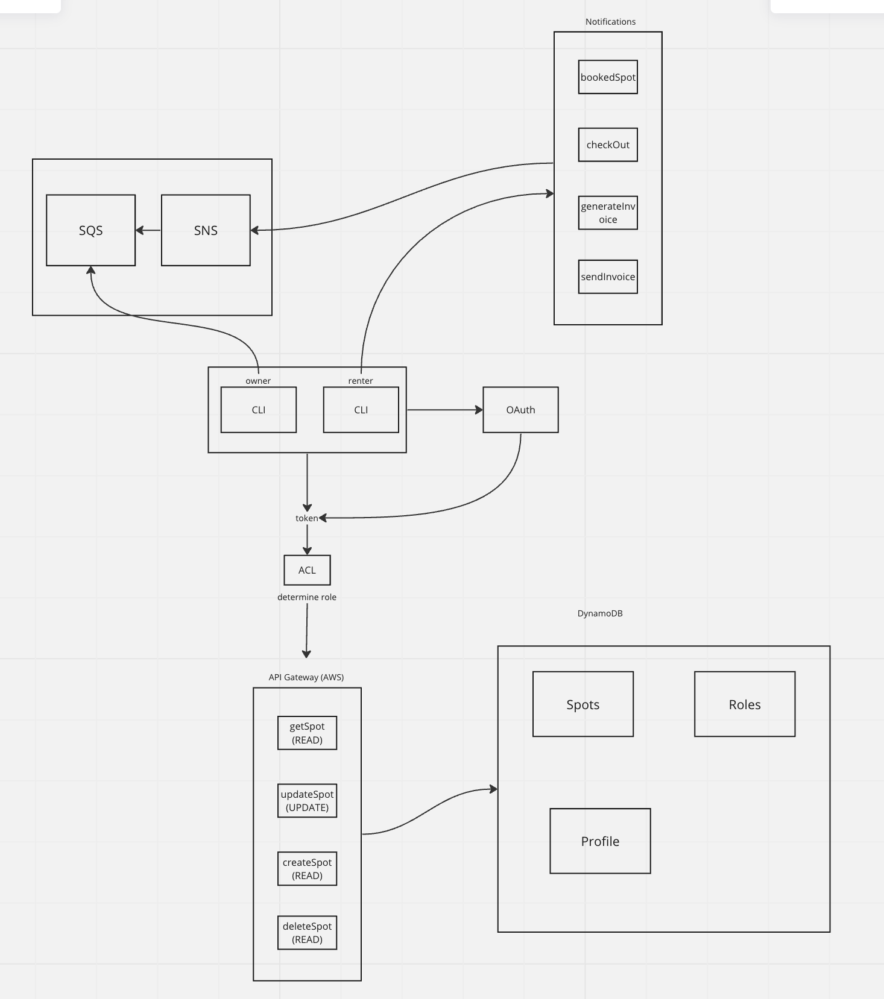
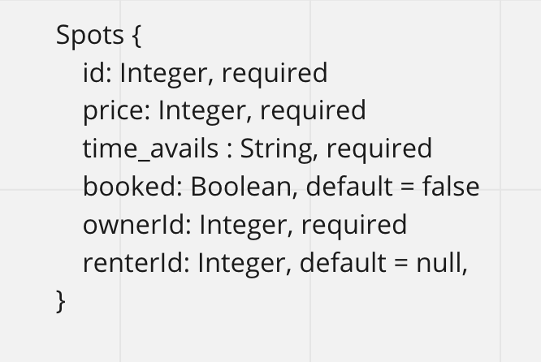

# Back-It-End: The Driveway Rental App

## Vision

The purpose of Back-It-End is to provide a simple, secure and convenient way to match drivers needing limited-term parking with real property owners who have excess driveway space to let out.  Back-It-End provides convenient and economical alternatives to searching for legal parking spots in one of the most congested metro areas in the US.  This application creates value to both Renters and Owners by providing much more granular parking options to commuters while providing a secondary one-off income stream for homeowners.  Lastly, the project is also environmentally friendly, reducing the time that commuters are idling in traffic.

## Scope

### In

- Display available driveway spots for rent.

- Allows a Renter to book an available parking spot.

- Notify Owners when Renters have both booked and checked out.

- Sends an invoice to the Renter on behalf of the Owner.

### Out

- The app is legally agnostic. It will not do any sort of validation with local ordinances to ensure renters and Owners have legal powers to rent.

- The app is not intended to have real-time, one-bus-away style functionality.

- Does not and will never server parking infractions directly to users.

#### Minimum Viable Product

- Back-It-End will allow Owner users to advertise the number of spots they have open, match them with Renters seeking spots, and provide an invoice to both parties after the Renter has vacated the Owner's spot.

##### Stretch Goals

- Owner can set price for different spot types ( reserved street parking, driveway, garage ) and specifiy max size of vehicle that can fit in the space ( motorcycle, small, medium, large, extra large ).

- Renter can specify the amount of time for which they would like to rent the spot.

- Set rules for vacating spot, i.e. late checkout will incur extra fees, failure to checkout within 12hrs of original checkout time will result in Renter's car being towed at Renter's expense.

- Inegtrate method to take payments.

### Functional Requirements

- Owner users can create spots to notify renter users of availability.

- Renter users can view all open spots.

- Renter users can select an open spot and reserve it from the Owner.

- Renter users can notify the Owner user that they have vacated the spot.

- Both renter and Owner users will receive an invoice after vacating the spot.

#### Data Flow Diagram

##### Non-Functional Requirements

- Spots will be occupied for only one hour duration, subject to change following proof of life / MVP.
